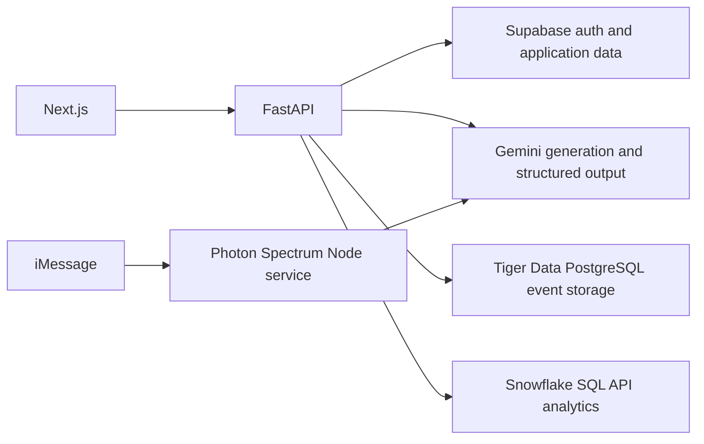

# Hackathon API setup

This adds optional Gemini, Snowflake, Tiger Data, and Photon Spectrum integrations to the
existing template. Supabase remains responsible for authentication, authorization, and the
existing application tables. No API credentials belong in Git or frontend public variables.

## Architecture



Snowflake and Tiger Data can coexist through server-side adapters. They are separate services
with separate SQL engines and credentials. You cannot install the Timescale PostgreSQL
extension inside a Snowflake warehouse. This starter does not automatically replicate data or
attempt a distributed transaction across databases. Choose one owner for each dataset; export
only the analytics fields your feature needs. The optional Tiger Data event schema stores IDs,
timestamps, and source/status labels, not message contents. Apply its SQL explicitly.

Adapters are constructed without network connections and report credential presence through
the existing authenticated `/api/v1/integrations/status` endpoint. Presence is not a live test.
Database SQL methods are server-side interfaces; no public arbitrary-SQL route is added.

## Install

From the repository root:

```powershell
npm.cmd run setup
npm.cmd --prefix services/photon ci
npm.cmd run doctor
```

The backend uses its existing `httpx` package for Gemini and Snowflake REST. Tiger Data uses
`psycopg[binary]==3.3.6`. Photon uses the official `spectrum-ts` package and Node 24; its Gemini
client uses built-in fetch. Optional provider credentials are not needed to run mocked tests.

## Gemini

1. Open [Google AI Studio API keys](https://aistudio.google.com/api-keys).
2. Create a separate project named `HackNC 2026`, then a key in that project. If AI Studio
   directs you to Google Cloud, create the project there and import it into AI Studio.
3. Google Cloud currently blocks this account until the user enables two-step verification.
   Complete that account security step yourself. No dedicated key has been created yet.
4. In `finalfrontentbackend/backendFINAL/.env`, set:

```dotenv
GEMINI_API_KEY=
GEMINI_MODEL=gemini-3.8-flash
AI_DEFAULT_PROVIDER=gemini
```

5. Run `npm.cmd run smoke:gemini` for one small live request. It refuses to send without a key.
   This may consume provider quota. Leave billing disabled unless you deliberately need it.

The existing AI routes and provider abstraction already support Gemini; OpenAI credentials
are unnecessary for this setup. [Gemini quickstart](https://ai.google.dev/gemini-api/docs/quickstart).

## Snowflake

1. Sign in to your hackathon/student Snowflake account and open Snowsight.
2. Create a dedicated database/schema and a small warehouse with automatic suspension.
3. Use a dedicated least-privilege role; create a programmatic access token under the user's
   authentication settings. Account policies may require an administrator or network policy.
4. Fill the following in the backend `.env`:

```dotenv
SNOWFLAKE_ACCOUNT_HOST=
SNOWFLAKE_TOKEN=
SNOWFLAKE_TOKEN_TYPE=PROGRAMMATIC_ACCESS_TOKEN
SNOWFLAKE_WAREHOUSE=
SNOWFLAKE_DATABASE=
SNOWFLAKE_SCHEMA=
SNOWFLAKE_ROLE=
```

The host is the exact account hostname, such as `org-account.snowflakecomputing.com`, without
`https://`, ports, or paths. `OAUTH` is supported when your account uses an OAuth bearer token.
The client supports bound parameters, asynchronous statement status polling, and a fixed
bound `SELECT` transport probe. Warehouse queries can consume credits; nothing executes at startup.
[SQL API](https://docs.snowflake.com/en/developer-guide/sql-api/index),
[programmatic access tokens](https://docs.snowflake.com/en/user-guide/programmatic-access-tokens).

## Tiger Data

1. Sign in to [Tiger Data](https://console.tigerdata.com/) and create a dedicated hackathon service.
2. Copy its PostgreSQL connection URI and download its recommended CA certificate if needed.
3. Set these backend variables; URL-encode special characters in a URI password:

```dotenv
TIGERDATA_DSN=
TIGERDATA_SSL_ROOT_CERT=
```

The adapter enforces `sslmode=verify-full`; the CA setting accepts a certificate file path or
libpq's `system` trust option on supported versions. Apply the explicit event schema in
`backendFINAL/app/integrations/tigerdata/schema.sql` before calling event methods. Then optionally
apply `hypertable.sql` to convert the events table where TimescaleDB is available. The client does not create
services, enable extensions, or run migrations automatically.
On Windows, psycopg async connections need a Selector event loop; the supplied reload-mode dev
command is compatible. See the [Tiger Data README](../backendFINAL/app/integrations/tigerdata/README.md)
for standalone Windows launch instructions and explicit SQL application.

## Photon Spectrum

1. Sign in to [Photon](https://app.photon.codes/dashboard).
2. Apply the official `HACKWITHPHOTON` promo and inspect checkout. The observed offer is $0 today
   but renews at $25/month next month. User completion is required for that recurring subscription;
   it has not been activated by the agent. Checkout also requests Link verification.
3. A dedicated free project was created. Add your genuine iMessage phone to your Photon account
   (setup currently reports `account_phone_missing`), obtain the project ID/secret, and confirm
   the project's managed line. Free/Pro plans use shared lines; allowlist the intended tester's
   exact iMessage handle in the project's Users tab. Dedicated lines require Business.
4. Copy `services/photon/.env.example` to `services/photon/.env`, then set:

```dotenv
SPECTRUM_PROJECT_ID=
SPECTRUM_PROJECT_SECRET=
GEMINI_API_KEY=
GEMINI_MODEL=gemini-3.8-flash
```

The Gemini key is optional for a local transport check; set it to enable real model replies.
You may privately reuse the dedicated hackathon Gemini key in this service's environment.
Run `npm.cmd --prefix services/photon start` for local terminal mode. Run
`npm.cmd --prefix services/photon start -- --imessage` after credentials and the line are ready.
Cloud mode connects to Photon and can reply to incoming messages. The service is separate from
FastAPI; it does not impersonate a Supabase user or send unverified phone identities into user routes.
[Spectrum setup](https://photon.codes/docs/spectrum-ts/getting-started),
[managed iMessage](https://photon.codes/docs/spectrum-ts/providers/imessage).
