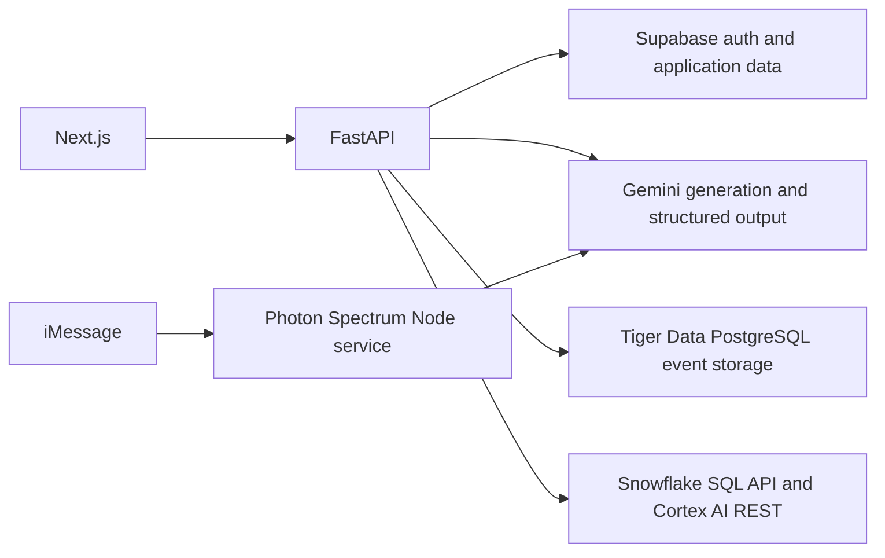

# Hackathon API setup

This adds optional Gemini, Snowflake, Tiger Data, and Photon Spectrum integrations to the
existing template. Supabase remains responsible for authentication, authorization, and the
existing application tables. No API credentials belong in Git or frontend public variables.

## Architecture



Snowflake and Tiger Data can coexist through server-side adapters. They are separate services
with separate SQL engines and credentials. You cannot install the Timescale PostgreSQL
extension inside a Snowflake warehouse. This starter does not automatically replicate data or
attempt a distributed transaction across databases. Choose one owner for each dataset; export
only the analytics fields your feature needs. The optional Tiger Data event schema stores IDs,
timestamps, and source/status labels, not message contents. Apply its SQL explicitly.

Adapters are constructed without network connections and report credential presence through
the existing authenticated `/api/v1/integrations/status` endpoint. Presence is not a live test.
Database SQL methods are server-side interfaces; no public arbitrary-SQL route is added.

## Install

From the repository root:

```powershell
npm.cmd run setup
npm.cmd --prefix services/photon ci
npm.cmd run doctor
```

The backend uses its existing `httpx` package for Gemini and Snowflake REST. Tiger Data uses
`psycopg[binary]==3.3.6`. Photon uses the official `spectrum-ts` package and Node 24; its Gemini
client uses built-in fetch. Optional provider credentials are not needed to run mocked tests.

## Gemini

The user is completing Google MFA and Gemini activation. No dedicated key or live response is
verified yet. Snowflake Cortex has its own independent credentials.

1. Open [Google AI Studio API keys](https://aistudio.google.com/api-keys).
2. AI Studio currently reports that the project must be created in Google Cloud. Open the
   [Cloud project form](https://console.cloud.google.com/projectcreate) and create `HackNC 2026`.
   Then open AI Studio's Projects view, choose Import projects, and import that project before
   creating a key in it. Keep billing disabled unless deliberately needed.
3. Google Cloud currently blocks this account until the user enables two-step verification.
   Complete that account security step yourself. No dedicated key has been created yet.
4. In `finalfrontentbackend/backendFINAL/.env`, set:

```dotenv
GEMINI_API_KEY=
GEMINI_MODEL=gemini-3.8-flash
AI_DEFAULT_PROVIDER=gemini
```

5. Set the same `GEMINI_API_KEY` and `GEMINI_MODEL` in `services/photon/.env` to enable that
   service's model replies. The backend environment is not automatically shared with Photon.
   Restart both services after editing their environments; values are loaded at startup.
6. Run `npm.cmd run smoke:gemini` for one small live request. It refuses to send without a key.
   This may consume provider quota. Leave billing disabled unless you deliberately need it.

The existing AI routes and provider abstraction already support Gemini; OpenAI credentials
are unnecessary for this setup. [Gemini quickstart](https://ai.google.dev/gemini-api/docs/quickstart).

## Snowflake

The [HackNC track page](https://past-cushion-a6f.notion.site/HackNC-Tracks-756816442900834e900c016919f003e8)
emphasizes access to language models through Snowflake REST, including chatbots and RAG.
The template includes both a SQL adapter and a separate Cortex text-generation adapter.
Merely configuring SQL credentials does not demonstrate the sponsor's AI use case.

1. Open the [student trial](https://signup.snowflake.com/?trial=student&referrer=snowsight).
   The signup page observed on October 10 offers 120 days and $400 of usage. Use the team's
   chosen email/country, verify the account yourself, and inspect the offered terms before signup.
2. Open Snowsight. Copy the exact account hostname and create a short-lived, scoped programmatic
   access token under the user's authentication settings. Account policies may require an
   administrator or network policy. Keep the token only in the ignored backend environment.
3. For Cortex, the user's **default role** needs `SNOWFLAKE.CORTEX_USER` or the narrower
   `SNOWFLAKE.CORTEX_REST_API_USER` database role. An administrator must grant privileges where
   necessary. Confirm the selected model is available in the account's region; a present token
   does not prove REST/model access. `SNOWFLAKE_ROLE` below applies to SQL requests, not to
   selecting Cortex's role.
   By default, PAT authentication also requires a network policy, even when a human user can
   generate a token without one. Allow the actual backend's egress addresses; do not disable
   network-policy enforcement to make the token work. Token creation alone is not a live test.
4. Fill the following in the backend `.env`:

```dotenv
SNOWFLAKE_ACCOUNT_HOST=
SNOWFLAKE_TOKEN=
SNOWFLAKE_TOKEN_TYPE=PROGRAMMATIC_ACCESS_TOKEN
SNOWFLAKE_CORTEX_MODEL=claude-sonnet-4-5
# Needed only when using the SQL adapter:
SNOWFLAKE_WAREHOUSE=
SNOWFLAKE_DATABASE=
SNOWFLAKE_SCHEMA=
SNOWFLAKE_ROLE=
```

The host is the exact account hostname, such as `org-account.snowflakecomputing.com`, without
`https://`, ports, or paths. `OAUTH` is supported when your account uses an OAuth bearer token.
The registered `integrations.snowflake_cortex.generate_text(prompt, system=..., max_tokens=...)`
returns a typed text/model result. It sends bounded non-streaming requests to
`/api/v2/cortex/v1/chat/completions` with Snowflake authentication; no OpenAI or Gemini key is needed.
It is an internal service interface, not a new public AI route or a Photon model connection.
Cortex calls consume credits and do not require creating an application database first.

For SQL features, create a dedicated database/schema and a small warehouse with automatic
suspension. The SQL client supports bound parameters, bounded status polling, and a fixed bound
`SELECT` probe. SQL can also consume credits. Nothing executes at startup; live access is pending.
[Cortex API and permissions](https://docs.snowflake.com/en/user-guide/snowflake-cortex/cortex-rest-api),
[SQL API](https://docs.snowflake.com/en/developer-guide/sql-api/index),
[programmatic access tokens](https://docs.snowflake.com/en/user-guide/programmatic-access-tokens).

## Tiger Data

1. Sign in to [Tiger Cloud](https://console.cloud.tigerdata.com/) and create a dedicated hackathon service.
2. Copy its PostgreSQL connection URI and download its recommended CA certificate if needed.
3. Set these backend variables; URL-encode special characters in a URI password:

```dotenv
TIGERDATA_DSN=
TIGERDATA_SSL_ROOT_CERT=
```

The adapter enforces `sslmode=verify-full`; the CA setting accepts a certificate file path or
libpq's `system` trust option on supported versions. Apply the explicit event schema in
`backendFINAL/app/integrations/tigerdata/schema.sql` before calling event methods. Then optionally
apply `hypertable.sql` to convert the events table where TimescaleDB is available. The client does not create
services, enable extensions, or run migrations automatically.
On Windows, psycopg async connections need a Selector event loop; the supplied reload-mode dev
command is compatible. See the [Tiger Data README](../backendFINAL/app/integrations/tigerdata/README.md)
for standalone Windows launch instructions and explicit SQL application.

## Photon Spectrum

1. Sign in to [Photon](https://app.photon.codes/dashboard).
2. The existing project's `HACKWITHPHOTON` subscription was activated after private checkout
   completion. The agent then canceled renewal as requested. Stripe confirms **Plan canceled**,
   with Spectrum Pro access until **November 10, 2026**. Do not reactivate it. For a fresh project,
   inspect any promo's renewal/payment terms before subscribing; the observed undiscounted plan
   was $25/month. No payment data or billing-session links belong in the repository.
3. A dedicated free project was created and its project ID/secret are already saved in the local,
   ignored `services/photon/.env`. Add your genuine iMessage phone in Account → General → Add phone
   (setup currently reports `account_phone_missing`); enter the six-digit SMS code yourself. Confirm
   the project's managed line. Free/Pro plans use shared lines; allowlist the intended tester's
   exact iMessage handle in the project's Users tab. Dedicated lines require Business.
4. For a fresh clone, copy `services/photon/.env.example` to `services/photon/.env` if absent, then set:

```dotenv
SPECTRUM_PROJECT_ID=
SPECTRUM_PROJECT_SECRET=
GEMINI_API_KEY=
GEMINI_MODEL=gemini-3.8-flash
```

The Gemini key is optional for a local transport check; set it to enable model replies.
You may privately reuse the dedicated hackathon Gemini key in this service's environment.
Run `npm.cmd --prefix services/photon start` for local terminal mode. Run
`npm.cmd --prefix services/photon start -- --imessage` after credentials and the line are ready.
Cloud mode connects to Photon and can reply to incoming messages. The service is separate from
FastAPI; it does not impersonate a Supabase user or send unverified phone identities into user routes.
[Spectrum setup](https://photon.codes/docs/spectrum-ts/getting-started),
[managed iMessage](https://photon.codes/docs/spectrum-ts/providers/imessage).
